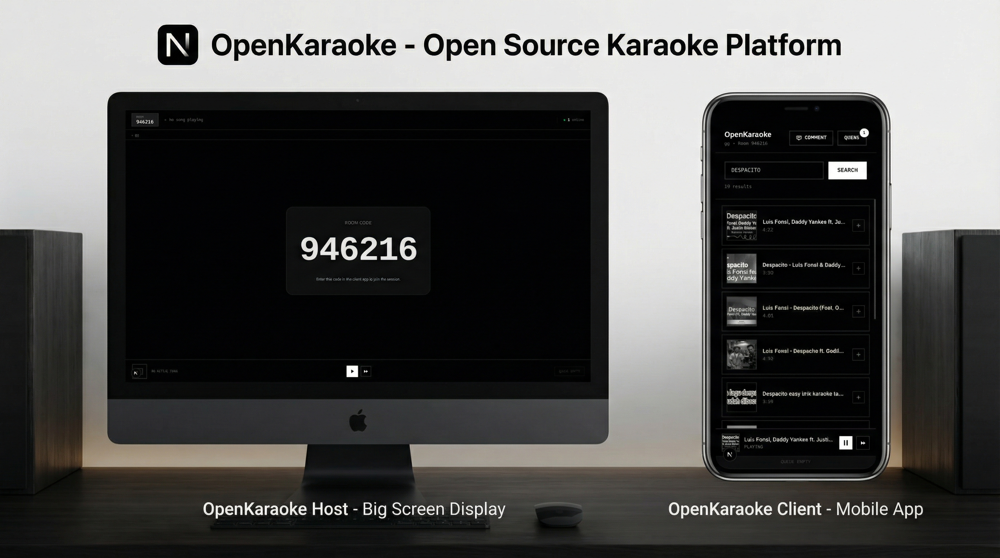
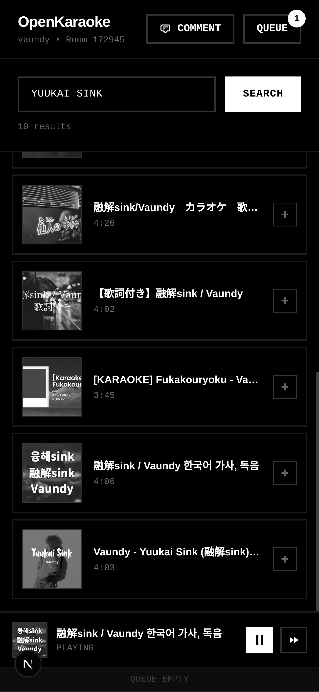

# OpenKaraoke 🎤

A modern, web-based karaoke application with real-time collaboration features. OpenKaraoke allows multiple users to connect to a shared karaoke session, queue songs, and interact through live comments.



## 🌟 Features

| Feature | Description |
|---------|-------------|
| **Host & Client Architecture** | One host displays the karaoke video while multiple clients can control playback and queue songs |
| **Real-time Synchronization** | WebSocket-based communication ensures all clients stay in sync |
| **YouTube Integration** | Search and play karaoke videos directly from YouTube |
| **Interactive Comments** | Users can send live comments that appear as floating overlays on the host screen |
| **Queue Management** | Collaborative song queue with real-time updates |
| **User Presence** | See who's connected to your karaoke session with live status indicators |
| **Responsive Design** | Clean, minimalist UI that works on desktop and mobile devices |
| **Room Code System** | Simple 6-digit codes for easy session joining |
| **Auto-play Queue** | Automatically plays the next song when current song ends |

## 📸 Screenshots

### Host View


### Client View
<p align="center">
  
</p>

## 🎯 About

OpenKaraoke is inspired by [PiKaraoke](https://github.com/vicwomg/pikaraoke), an open-source karaoke system. This project reimagines the karaoke experience with a modern web stack, real-time collaboration features, and a sleek user interface.

**Current Status**: Self-hosted solution. Cloud hosting and additional features coming soon!

## 🚀 Getting Started

### Prerequisites

- **Python 3.8+** (for backend)
- **Node.js 16+** (for frontend)
- **npm** or **yarn**

### Installation

#### 1. Clone the repository

```bash
git clone https://github.com/yourusername/openkaraoke.git
cd openkaraoke
```

#### 2. Backend Setup

```bash
cd backend

# Create a virtual environment (recommended)
python -m venv venv
source venv/bin/activate  # On Windows: venv\Scripts\activate

# Install dependencies
pip install -r requirements.txt
```

#### 3. Frontend Setup

```bash
cd frontend

# Install dependencies
npm install
# or
yarn install
```

#### 4. Environment Variables

Create a `.env.local` file in the `frontend` directory:

```env
NEXT_PUBLIC_API_URL=http://localhost:8000
```

### Running the Application

The easiest way to run OpenKaraoke is using the provided `dev.sh` script:

```bash
chmod +x dev.sh
./dev.sh
```

This will start both the backend (FastAPI) and frontend (Next.js) servers concurrently.

**Alternatively, run them separately:**

**Backend:**
```bash
cd backend
uvicorn main:app --reload --host 0.0.0.0 --port 8000
```

**Frontend:**
```bash
cd frontend
npm run dev
# or
yarn dev
```

### Accessing the Application

- **Frontend**: http://localhost:3000
- **Backend API**: http://localhost:8000
- **API Docs**: http://localhost:8000/docs

## 📖 Usage

### Starting a Session

1. Navigate to `/host` to create a new karaoke session
2. A room code will be displayed on the screen
3. Share this code with participants

### Joining a Session

1. Navigate to `/client` 
2. Enter your username and the room code
3. Start searching for songs and adding them to the queue!

### Features

- **Search Songs**: Use the search bar to find karaoke tracks from YouTube
- **Queue Management**: View the current queue and see who added each song
- **Playback Controls**: Play, pause, and skip songs (host controls)
- **Live Comments**: Send messages that appear on the host screen
- **User Presence**: See all connected users in real-time

## 🛠️ Tech Stack

### Backend
- **FastAPI**: High-performance Python web framework
- **WebSockets**: Real-time bidirectional communication
- **youtube-search-python**: YouTube integration for song search

### Frontend
- **Next.js 14**: React framework with App Router
- **TypeScript**: Type-safe development
- **Tailwind CSS**: Utility-first styling
- **React Player**: Video playback
- **WebSocket Client**: Real-time updates

## 📦 Project Structure

```
openkaraoke/
├── backend/
│   ├── main.py              # FastAPI application entry point
│   ├── rooms.py             # Room and WebSocket management
│   ├── requirements.txt     # Python dependencies
│   └── ...
├── frontend/
│   ├── app/
│   │   ├── host/           # Host view page
│   │   ├── client/         # Client view page
│   │   └── ...
│   ├── ui/
│   │   └── components/     # Reusable UI components
│   ├── package.json
│   └── ...
├── dev.sh                   # Development startup script
└── README.md
```

## 🔧 Configuration

### Backend Configuration

Edit `main.py` to customize:
- CORS settings
- WebSocket endpoints
- Room ID generation

### Frontend Configuration

Edit `.env.local` for:
- API URL configuration
- Environment-specific settings

## 🤝 Contributing

Contributions are welcome! Please feel free to submit a Pull Request.

1. Fork the project
2. Create your feature branch (`git checkout -b feature/AmazingFeature`)
3. Commit your changes (`git commit -m 'Add some AmazingFeature'`)
4. Push to the branch (`git push origin feature/AmazingFeature`)
5. Open a Pull Request

## 📝 License

This project is open source and available under the [MIT License](LICENSE).

## 🙏 Acknowledgments

- Inspired by [PiKaraoke](https://github.com/vicwomg/pikaraoke)
- Built with amazing open-source tools and libraries

## 📧 Contact

For questions, issues, or suggestions, please open an issue on GitHub.

## 🗺️ Roadmap

- [ ] Cloud hosting support
- [ ] User accounts and profiles
- [ ] Playlist management
- [ ] Recording capabilities
- [ ] Mobile apps (iOS/Android)
- [ ] Custom themes and branding
- [ ] Advanced audio controls
- [ ] Multiple room support per host

---

**Made by Zaid Zaihan @2025**